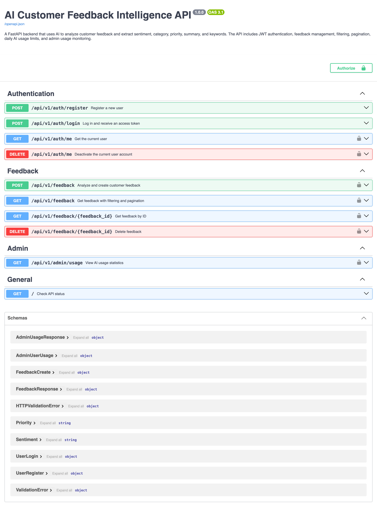
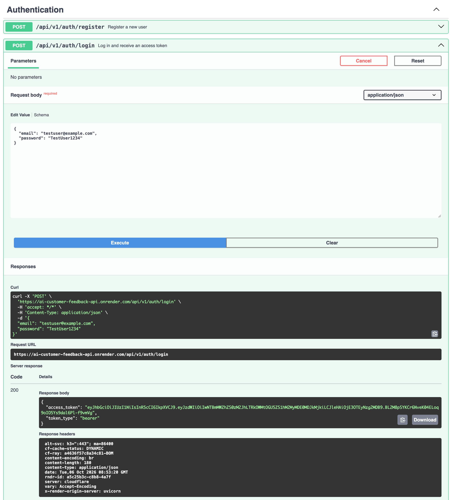
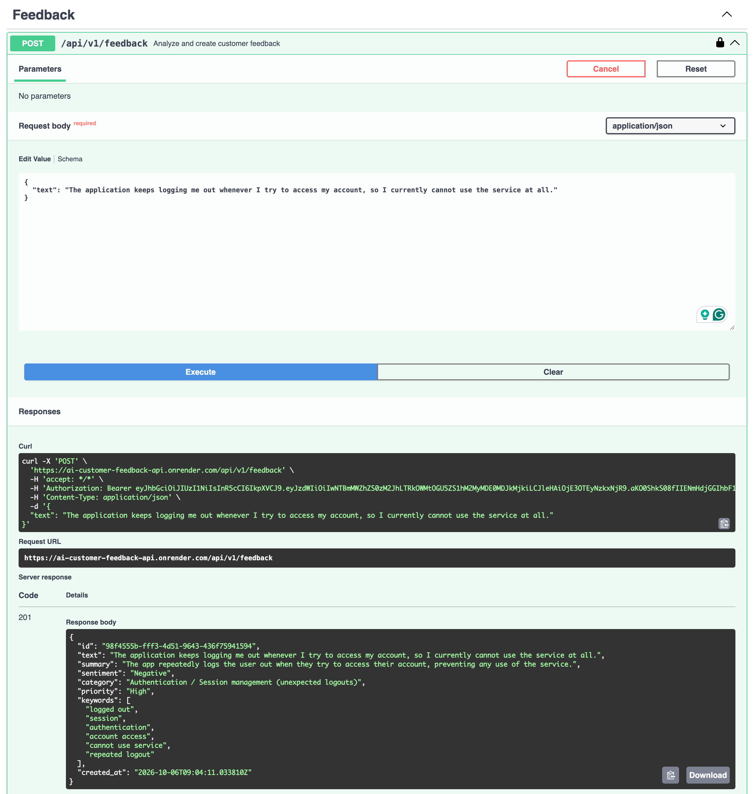
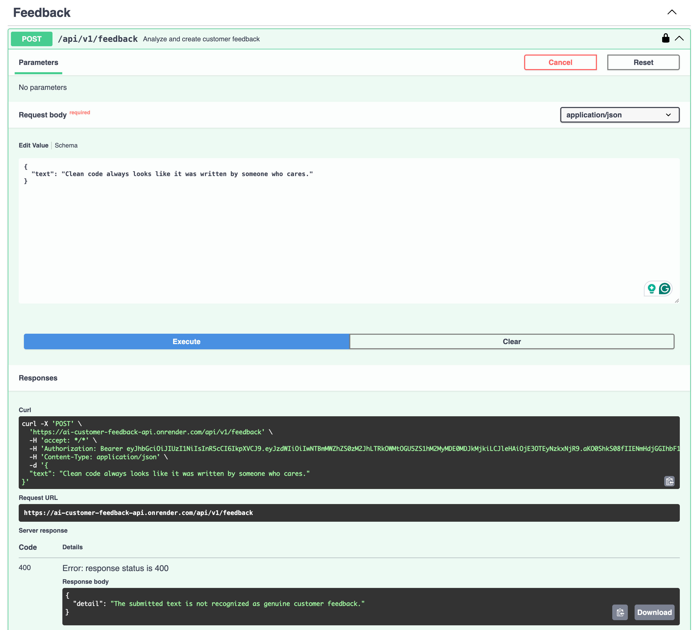
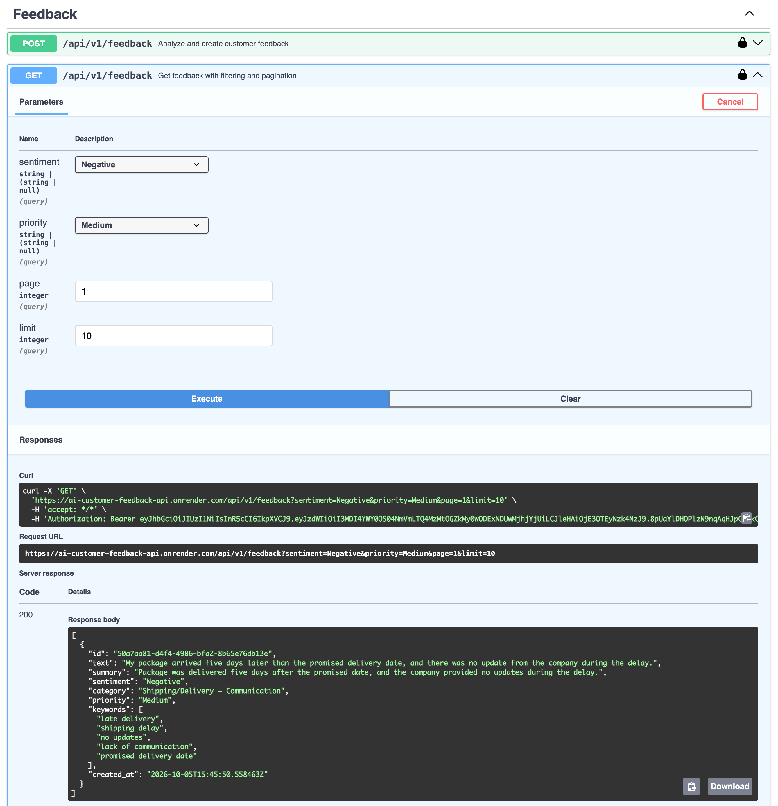
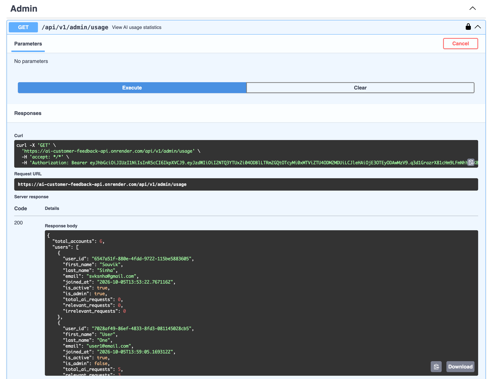

# AI Customer Feedback Intelligence API

A production-deployed FastAPI backend that uses OpenAI to analyze customer feedback and turn unstructured text into structured, actionable insights.

The API supports JWT authentication, AI-powered feedback analysis, PostgreSQL persistence, filtering, pagination, daily AI usage protection, request logging, admin usage monitoring, automated testing, and interactive Swagger documentation.

**Live API (Swagger):** https://ai-customer-feedback-api.onrender.com/docs


## What This API Does

Registered users can submit customer feedback through the API. Each submission is analyzed by OpenAI to determine whether it represents genuine customer feedback and, when relevant, extract a summary, sentiment, category, priority, and keywords.

Relevant feedback is stored in PostgreSQL and can be retrieved, filtered, paginated, and deleted by the owning user. Every AI analysis request is also recorded separately, allowing the application to track both relevant and irrelevant submissions for usage monitoring.

Admins have access to a dedicated usage endpoint that provides per-user AI request statistics, including total, relevant, and irrelevant requests.


## What It Demonstrates

-   Clean RESTful API design with FastAPI
-   JWT authentication and protected endpoints
-   User-level authorization and admin-only access
-   Pydantic request validation and response schemas
-   SQLAlchemy ORM with PostgreSQL
-   Alembic database migrations
-   OpenAI structured output with Pydantic
-   AI-powered sentiment, category, priority, summary, and keyword extraction
-   Customer-feedback relevance detection
-   Feedback filtering and pagination
-   Daily AI usage protection
-   AI request logging and usage monitoring for admin
-   Centralized error handling and application logging
-   Automated API testing with pytest
-   Production deployment on Render with Neon PostgreSQL


## Tech Stack

-   **Python 3.13**
-   **FastAPI**
-   **Pydantic**
-   **SQLAlchemy**
-   **PostgreSQL**
-   **Neon**
-   **Alembic**
-   **OpenAI API**
-   **JWT / PyJWT**
-   **pytest**
-   **uv**
-   **Render**


## Core Features

### Authentication

-   User registration with password confirmation
-   Password hashing with Argon2
-   JWT-based login
-   Protected endpoints
-   Account deactivation
-   Admin authorization

### AI Feedback Analysis

Each feedback submission is analyzed using OpenAI structured output. The API extracts:

-   Customer-feedback relevance
-   Summary
-   Sentiment
-   Category
-   Priority
-   Keywords

The AI response is parsed directly into a Pydantic schema rather than being handled as unstructured text.

### Feedback Management

-   Create analyzed feedback
-   Retrieve stored feedback
-   Retrieve individual feedback
-   Delete feedback
-   Sentiment filtering
-   Priority filtering
-   Pagination

### Usage Protection & Request Logging

-   Daily AI request limit for normal users
-   Admin privilege for usage monitoring
-   Every AI analysis request is logged
-   Relevant and irrelevant submissions are tracked separately
-   OpenAI service failures return a controlled `503` response
-   Daily limit violations return `429 Too Many Requests`

### Admin Monitoring

Administrators can view:

-   Total registered accounts
-   Total AI requests per user
-   Relevant requests
-   Irrelevant requests
-   Account status
-   Admin status
-   User join date


## How the API Works

``` text
Register
   │
   ▼
Login
   │
   ▼
Receive JWT access token
   │
   ▼
POST /api/v1/feedback
   │
   ▼
JWT Authentication
   │
   ▼
Daily AI Usage Check
   │
   ▼
OpenAI Structured Analysis
   │
   ├── Not customer feedback
   │       │
   │       ├── Log AI request
   │       └── Return 400
   │
   └── Customer feedback
           │
           ├── Log AI request
           │
           ▼
       Store analyzed feedback
           │
           ▼
       Return structured response
```


## Database Design

The application uses PostgreSQL with three main application tables:

### `users`

Stores registered users and authentication/authorization information. Important fields include:

-   UUID primary key
-   Name and email
-   Hashed password
-   Active/inactive status
-   Admin status
-   Account creation timestamp

### `feedback`

Stores successfully accepted customer feedback together with its AI-generated analysis. Important fields include:

-   UUID primary key
-   User reference
-   Original feedback text
-   AI-generated summary
-   Sentiment
-   Category
-   Priority
-   Keywords
-   Creation timestamp

### `api_request_logs`

Stores every AI analysis request made by a user. Important fields include:

-   UUID primary key
-   User reference
-   Submitted request text
-   Customer-feedback relevance result
-   Creation timestamp

Because request logs are separate from feedback records, deleting a feedback record does not remove the corresponding AI request activity from the usage history.


## API Endpoints

  `POST`                  `/api/v1/auth/register`   - Register a new user

  `POST`                  `/api/v1/auth/login`      - Log in and
                                                    receive a JWT access token

  `GET`                   `/api/v1/auth/me`         - Get the current
                                                    authenticated user

  `DELETE`                `/api/v1/auth/me`         - Deactivate the current
                                                    account

  `POST`                  `/api/v1/feedback`        - Analyze and create
                                                    customer feedback

  `GET`                   `/api/v1/feedback`        - List the user's
                                                    feedback

  `GET`                   `/api/v1/feedback/{id}`   - Retrieve a specific
                                                    feedback record

  `DELETE`                `/api/v1/feedback/{id}`   - Delete a feedback
                                                    record

  `GET`                   `/api/v1/admin/usage`     - View AI usage
                                                    statistics as an
                                                    administrator


## API Documentation Preview

The deployed API includes interactive Swagger/OpenAPI documentation. The following examples demonstrate the main workflows supported by the API.


### 1. Swagger API Overview
The interactive Swagger UI provides the complete API surface, organized into Authentication, Feedback, Admin, and General endpoints. It also supports the `Authorize` workflow for testing protected endpoints with a JWT.


---

### 2. User Registration & Authentication
Users can register and authenticate through JWT-based authentication before accessing protected API resources.


---

### 3. AI-Powered Feedback Analysis
A submitted feedback message is analyzed by OpenAI and returned as structured data containing a summary, sentiment, category, priority, and keywords. The endpoint also determines whether the submitted text represents genuine customer feedback.


---
### 4. Irrelevant Feedback Detection
The API detects submissions that do not represent customer feedback and rejects them instead of storing them as feedback records. The request is still recorded in `api_request_logs`, so AI usage and activity remain traceable.


---

### 5. Feedback Filtering & Pagination
Stored feedback can be filtered by sentiment or priority and retrieved using paginated API responses. This keeps feedback retrieval manageable as the number of stored records grows.


---

### 6. Admin AI Usage Monitoring
Admins can view AI request activity across registered users, including total, relevant, and irrelevant submissions. The endpoint provides a centralized view of AI usage while remaining restricted to administrator accounts.



---

## Testing

The project includes a pytest test suite covering core application behavior, including:

-   Root endpoint
-   User registration
-   Authentication
-   Protected endpoints
-   Feedback validation
-   Feedback creation
-   Irrelevant feedback handling
-   Feedback retrieval
-   Filtering
-   Pagination
-   Feedback deletion
-   Admin access control
-   Admin usage endpoint

The final test suite contains **14 tests**, all passing.

``` text
14 passed
```

Tests use a separate test database environment so production data is not affected.


## Production & Deployment

The API is deployed on **Render** and uses **Neon PostgreSQL** for the production database. Production configuration includes:

-   Render deployment
-   Neon-hosted PostgreSQL
-   Environment-based secrets and configuration
-   Alembic migrations
-   Production logging
-   OpenAI API integration
-   Public Swagger/OpenAPI documentation


## Engineering Decisions

### Structured AI Output

OpenAI responses are parsed directly into a Pydantic model. This keeps the AI response predictable and allows the API to validate the structure before storing the analysis.

### Separate AI Request Logs

AI requests are logged separately from feedback records. This allows the application to track every AI analysis request, including submissions that are considered irrelevant feedback.

### Daily AI Usage Protection

Normal users are limited to a fixed number of feedback-analysis requests per day. The check occurs before the OpenAI call.

### UTC Database Timestamps

Database timestamps are stored in UTC. The application's daily usage calculation uses the intended application timezone when determining the start of a calendar day.

### Account Deactivation

User accounts are deactivated rather than physically deleted. This preserves historical relationships and provides a simple account lifecycle.

### Feedback Deletion

Feedback records can be permanently deleted by the owning user. The separate AI request log remains available for activity and usage history.

### Admin Usage Monitoring

Usage statistics are calculated from the request log rather than the feedback table. This ensures that irrelevant AI requests are also included in usage reporting.


## Future Enhancements

This version focuses on the core backend and AI workflow. Potential future improvements include:

-   Advanced feedback analytics endpoints for dashboard
-   Configurable AI usage limits
-   Background processing for higher-volume workloads


---

Author: **Souvik Sinha**
